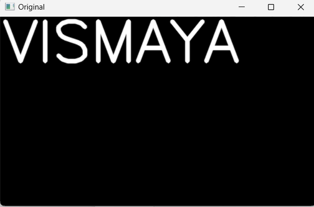
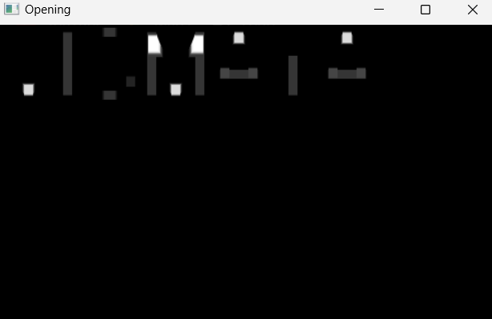
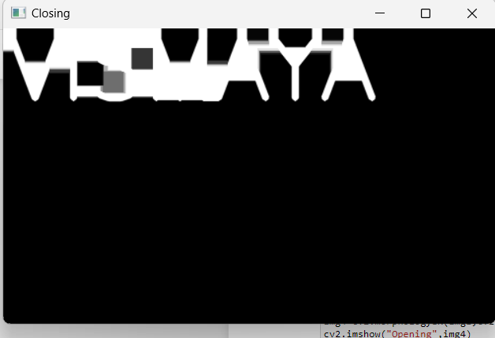

# Opening-and-Closing

## Aim
To implement Opening and Closing using Python and OpenCV.

## Software Required
1. Anaconda - Python 3.7
2. OpenCV
## Algorithm:
### Step1: 
Import necessary packages
<br>


### Step2:
<br> Add the text using the put text command

### Step3:
<br> Create the structring element

### Step4:
<br> Perform opening and closing operations

### Step5:
<br> End the program

 
## Program:

DEVELOPED BY : VISMAYA.S
REG NO : 212221230125
``` Python
# Import the necessary packages
import cv2
import numpy as np
import matplotlib.pyplot as plt

# Create the Text using cv2.putText
img1=np.zeros((300,500),dtype='uint8')
font=cv2.FONT_ITALIC
img2=cv2.putText(img1,"VISMAYA",(5,70),font,3,(255,0,0),5,cv2.LINE_AA)
cv2.imshow("Original",img2)
cv2.waitKey(0)
cv2.destroyAllWindows()

# Create the structuring element
kernel1=cv2.getStructuringElement(cv2.MORPH_RECT,(21,21))
kernel2=cv2.getStructuringElement(cv2.MORPH_RECT,(9,9))

# Use Opening operation
img4=cv2.morphologyEx(img1,cv2.MORPH_OPEN,kernel2)
cv2.imshow("Opening",img4)
cv2.waitKey(0)
cv2.destroyAllWindows()

# Use Closing Operation
img3=cv2.morphologyEx(img1,cv2.MORPH_CLOSE,kernel1)
cv2.imshow("Closing",img3)
cv2.waitKey(0)
cv2.destroyAllWindows()

```
## Output:

### Display the input Image
<br>
<br>
<br>
<br>
<br>
<br>

### Display the result of Opening
<br>
<br>
<br>
<br>
<br>
<br>

### Display the result of Closing
<br>
<br>
<br>
<br>
<br>
<br>

## Result
Thus the Opening and Closing operation is used in the image using python and OpenCV.